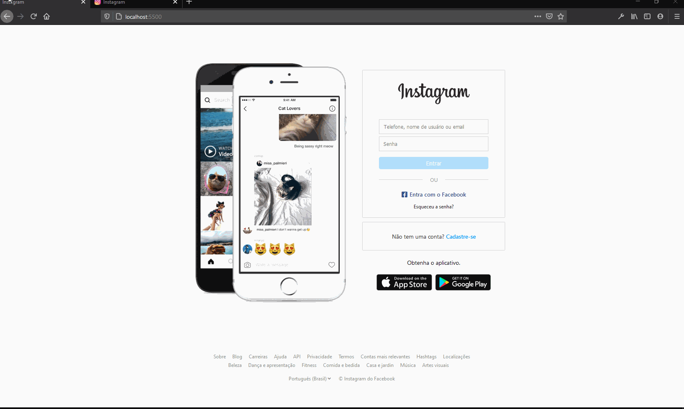

<h1 align="center">
  UI Clone Home Page Instagram  
  
</h1>

</br>
</br>
   
## ℹ Sobre

pratica de html css javascript

</br>
</br>


</br>
</br>

<h2>
Aplicação

</h2>

</br>
</br>

## 🚀 Tecnologias utilizadas:

- Css3
- Html5
- JavaScript

</br>
</br>

## 💻 Como utilizar

```bash

# clonar o repositório
$ git clone https://github.com/ivopereira-jr/30-Days-Css.git

```

---

</br>
</br>

## 💬 Vamos trocar ideias

[_Entre em contato comigo_](https://www.linkedin.com/in/ivopereira-jr/)

Obrigado(a) pela visita! 💜
